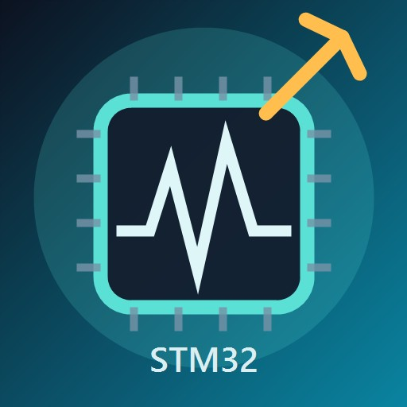

<div align="center">

# 🔬 STM32 Live Watch

**STM32 实时变量监视与图表可视化 VS Code 插件**

[](https://github.com/1581525057/stm32-vscode-Live-watch/releases)
[](https://code.visualstudio.com/)
[](LICENSE)
[](https://github.com/1581525057/stm32-vscode-Live-watch)

**中文** | [English](README_EN.md)

---



</div>

## 📖 为什么做这个插件？

### 痛点

Keil MDK 作为 STM32 开发的事实标准，其内置调试器多年来几乎未更新：界面古旧、操作卡顿、变量监视窗口功能单一。在调试 PID 参数、电机控制、传感器融合等需要频繁观测和修改变量的场景中，每次都要在 Keil 的 Watch 窗口里手动展开结构体、逐层翻找成员——效率极低，且无法直观看到变量随时间的变化趋势。

更麻烦的是，**传统 Keil 工程 ≠ 过时代码**。大量成熟项目基于 Keil 工程构建，包含多年积累的驱动、协议栈和业务逻辑——但它们值得一个更好的调试体验。

### 解决方案

**EIDE** 是一个出色的 VS Code 嵌入式插件，它能直接导入 Keil 工程（`.uvprojx`），在不改变原有代码结构的前提下，将整个开发流程迁移到 VS Code 的现代化界面中。

`stm32-vscode-Live-watch` 正是在这个工作流上补齐了最后一块短板——**实时变量调试**：

| 对比 | Keil 内置调试 | STM32 Live Watch |
|:----:|:------------:|:----------------:|
| 界面 | 古旧 Windows 风格，不可定制 | VS Code 原生 UI，主题自适应 |
| 变量监视 | 手动刷新，逐层展开 | 自动轮询 250ms 刷新，图表可视化 |
| 操作流畅度 | 卡顿明显 | 流畅，优化的批量内存读取 |
| 值编辑 | 右键菜单多步操作 | 树视图内直接编辑 |
| 图表 | 无 | 多变量实时走势图，支持 20ms~250ms 刷新率 |
| 多页面 | 无 | 支持多个 Watch 页面分组管理 |
| 新老代码兼容 | — | 基于 ELF/DWARF，与 Keil/EIDE 工程完全兼容 |

### 一句话总结

> **不放弃传统 Keil 工程，老代码和新代码一起享受 VS Code 的现代化调试体验——实时修改变量、图表可视化、告别 Keil 的卡顿和软件来回切换。**

<div align="center">

### 🎯 工作原理

```
┌─────────────────────────────────────────────────────────────┐
│  VS Code 扩展界面                                           │
│  ├── 📊 实时变量树                                          │
│  ├── 📈 实时图表可视化                                      │
│  └── ⚡ 快速变量编辑                                        │
└─────────────────────────────────────────────────────────────┘
                          ↓
┌─────────────────────────────────────────────────────────────┐
│  Python 后端服务                                            │
│  ├── 🔍 ELF/DWARF 解析器                                   │
│  └── 🔌 OpenOCD TCL RPC 客户端                              │
└─────────────────────────────────────────────────────────────┘
                          ↓
┌─────────────────────────────────────────────────────────────┐
│  STM32 目标板                                               │
│  └── 💾 通过调试接口读写内存                                │
└─────────────────────────────────────────────────────────────┘
```

</div>

## ✨ 核心功能

<div align="center">

| 功能 | 说明 |
|:----:|:-----|
| 🔍 | **实时变量监视** - 以 250ms 间隔实时更新变量值 |
| 📈 | **实时图表可视化** - 绘制多个变量，支持自定义时间窗口 |
| ✏️ | **快速值编辑** - 直接在变量树中修改变量值 |
| 🔄 | **自动 AXF→ELF 转换** - 与 EIDE 构建系统无缝集成 |
| 🎨 | **VS Code 主题集成** - 自动适配当前 VS Code 主题 |
| 📊 | **多页面支持** - 跨多个监视页面组织变量 |
| 🚀 | **高性能** - 优化的轮询调度器和批量内存读取 |

</div>

## 🚀 快速开始

### 安装

<div align="center">

#### 方式一：从 GitHub Releases 下载 VSIX 安装（推荐）

[](https://github.com/1581525057/stm32-vscode-Live-watch/releases/tag/v4.1.0)

</div>

1. 从 [Releases 页面](https://github.com/1581525057/stm32-vscode-Live-watch/releases) 下载最新 `.vsix` 文件
2. 打开 VS Code
3. 按 `Ctrl+Shift+P`，输入 `vsix`，选择 `Extensions: Install from VSIX...`
4. 选择下载的 `.vsix` 文件

#### 方式二：从源码构建

```bash
# 克隆仓库
git clone https://github.com/1581525057/stm32-vscode-Live-watch.git
cd stm32-vscode-Live-watch

# 安装依赖并构建
npm install
npm run compile
npx vsce package
```

### 环境要求

<div align="center">

| 要求 | 版本 | 用途 |
|:----:|:----:|:----:|
|  | 1.85.0+ | IDE |
|  | 16+ | 构建工具 |
|  | 最新版 | 工程管理 |
|  | 任意版本 | 调试接口 |

</div>

## 📸 界面预览

<div align="center">

### 变量树视图
```
┌─────────────────────────────────────┐
│ 📊 ━━━ Watch1 ━━━     Page 1/2 • 3 │
├─────────────────────────────────────┤
│ ▸ pid_yaw { ··· }                   │
│   ├─ Kp = 1.5                       │
│   ├─ Ki = 0.3                       │
│   └─ Kd = 0.1                       │
│ ▸ sensor_data { ··· }               │
│   ├─ temperature = 25.6             │
│   └─ humidity = 60.2                │
└─────────────────────────────────────┘
```

### 实时图表
```
┌─────────────────────────────────────┐
│ ⏸ 暂停 │ 🗑 清除 │ 时间窗口: 10s   │
├─────────────────────────────────────┤
│    ╭──╮                            │
│ ───╯  ╰─────╮                      │
│              ╰──────                │
│ ● Kp: 1.5  ● Ki: 0.3  ● Kd: 0.1  │
└─────────────────────────────────────┘
```

</div>

## 🎮 使用方法

### 基本流程

```
1️⃣  编译 EIDE 工程
      ↓
2️⃣  启动 OpenOCD（开启 TCL RPC）
      ↓
3️⃣  启动 Cortex-Debug 调试会话
      ↓
4️⃣  打开 STM32 Live Watch 面板
      ↓
5️⃣  点击 "启动服务器"
      ↓
6️⃣  添加监视变量
      ↓
7️⃣  开始监视和分析！
```

### 添加变量

**方式一：手动输入**
- 点击 `+ 添加变量` 按钮
- 输入变量名（例如 `pid_yaw`）

**方式二：从编辑器添加**
- 在 C/C++ 代码中选中变量名
- 右键 → `STM32 Live Watch: 添加选中的变量`

### 图表控制

| 控制 | 操作 |
|:----:|:-----|
| `+ 添加` | 添加变量到图表 |
| `⏸ 暂停` | 冻结图表以便检查 |
| `▶ 继续` | 恢复数据采集 |
| `🗑 清除` | 清除所有图表数据 |
| `时间窗口` | 设置时间窗口（10s/30s/60s/120s） |
| `刷新间隔` | 设置刷新率（20ms/50ms/100ms/250ms） |

## ⚙️ 配置项

<div align="center">

| 配置项 | 默认值 | 说明 |
|:------:|:------:|:----:|
| `stm32LiveWatch.elfPath` | `""` | 手动指定 ELF 文件路径 |
| `stm32LiveWatch.fromelfPath` | `""` | Keil fromelf.exe 路径 |
| `stm32LiveWatch.openocdHost` | `127.0.0.1` | OpenOCD 主机地址 |
| `stm32LiveWatch.openocdPort` | `50001` | OpenOCD TCL RPC 端口 |
| `stm32LiveWatch.refreshInterval` | `250` | 变量刷新间隔（毫秒） |
| `stm32LiveWatch.chartRefreshInterval` | `100` | 图表刷新间隔（毫秒） |
| `stm32LiveWatch.chartTimeWindow` | `10` | 图表时间窗口（秒） |

</div>

## 📋 命令列表

<div align="center">

| 命令 | 说明 |
|:----:|:-----|
| `启动服务器` | 启动变量监视服务 |
| `停止服务器` | 停止变量监视服务 |
| `添加变量` | 添加变量到监视列表 |
| `添加选中的变量` | 从编辑器添加选中的变量 |
| `刷新变量` | 手动刷新变量值 |
| `从 AXF 生成 ELF` | 转换 EIDE AXF 为 ELF |
| `配置 ELF 路径` | 手动配置 ELF 文件 |
| `编辑变量值` | 修改变量值 |
| `添加到图表` | 添加变量到图表可视化 |

</div>

## 🔧 支持的类型

```
✅ 基础类型
   ├── int, uint8_t, float, double 等
   └── 枚举：显示数值和名称

✅ 复合类型
   ├── 结构体：可展开成员
   ├── 类：公有成员
   ├── 数组：索引元素 [0], [1], ...
   └── 联合体：共享内存成员

✅ 特殊类型
   ├── 字符串：字符数组
   └── 指针：地址显示
```

## 📁 项目结构

```
stm32-vscode-Live-watch/
├── 📂 src/
│   ├── 📄 extension.ts              # 扩展入口
│   ├── 📄 elfResolver.ts            # ELF/DWARF 解析器
│   ├── 📄 serverClient.ts           # 后端通信
│   ├── 📄 pollScheduler.ts          # 轮询调度器
│   ├── 📄 variableTreeDataProvider.ts # 变量树 UI
│   ├── 📄 chartPanel.ts             # 图表 Webview
│   ├── 📄 chartManager.ts           # 图表数据管理
│   └── 📄 axfWatcher.ts             # AXF 文件监视
├── 📂 resources/
│   ├── 🖼️ icon.jpg                  # 扩展图标
│   ├── 📄 chart.html                # 图表模板
│   └── 📄 chart.js                  # 图表渲染脚本
├── 📂 bin/                          # 后端可执行文件
├── 📂 tests/                        # 测试文件
└── 📄 package.json                  # 扩展清单
```

## 🐛 常见问题

<details>
<summary><b>❓ 找不到 AXF 文件</b></summary>

- 确保项目有 `.eide/eide.yml` 文件
- 检查 `outDir` 目录是否包含 `.axf` 文件
- 验证 EIDE 构建是否成功完成

</details>

<details>
<summary><b>❓ 找不到 fromelf.exe</b></summary>

在 VS Code 设置中配置：
```
stm32LiveWatch.fromelfPath = D:\Keil5\ARM\ARMCLANG\bin\fromelf.exe
```
或将 `fromelf.exe` 所在目录添加到系统 PATH。

</details>

<details>
<summary><b>❓ 变量没有值</b></summary>

检查：
- ELF 文件是否与目标板上的固件匹配
- OpenOCD 是否正在运行且可访问
- 目标板是否处于调试状态（已暂停）

</details>

<details>
<summary><b>❓ C++ 类无法展开</b></summary>

- 添加对象实例名，而非类名
- ✅ 正确：`pid_yaw`
- ❌ 错误：`PID`
- 确保启用了调试信息（`-g` 编译选项）

</details>

## 📊 版本历史

<div align="center">

| 版本 | 日期 | 亮点 |
|:----:|:----:|:-----|
| `4.1.0` | 2026-06-06 | 删除自动重连，仅保留手动重连 |
| `4.0.3` | 2026-06-01 | 增强页面指示器，添加装饰分隔线 |
| `4.0.2` | 2026-06-01 | Watch 页面指示器 UI 优化 |
| `4.0.1` | 2026-06-01 | 移除结构体/类/数组拖拽限制 |
| `4.0.0` | 2026-06-01 | 图表 UI 改进，120s 窗口，50Hz 刷新 |
| `3.7.0` | 2026-05-11 | 统一轮询调度器，DWARF 缓存，SVG 图标 |
| `3.5.0` | 2026-05-05 | AC5/AC6 编译器兼容，性能优化 |
| `3.3.0` | 2026-05-04 | Bug 修复，联合体支持，枚举修复 |
| `3.1.0` | 2026-05-03 | 图表主题适配，统计，导出 |
| `3.0.0` | 2026-05-02 | 变量图表可视化模块 |
| `2.1.0` | 2026-05-01 | 变量显示优化 |

</div>

## 🙏 致谢

本项目参考了 [stm32-debug-helper](https://github.com/ZEALHT001/stm32-debug-helper)，感谢作者提供的源码思路。

## 📝 许可证

本项目采用 MIT 许可证 - 详见 [LICENSE](LICENSE) 文件。

---

<div align="center">

**由 [ciyueYe](https://github.com/1581525057) 用 ❤️ 制作**


</div>
